Практика Байзульдинова Захара Сыремовича, Б-ИФСТ-11

# Отчёт по летней практике

## Детекция страховочного пояса при выполнении работ на высоте

| Параметр | Значение |
|---|---|
| Практика | 2026 — компьютерное зрение |
| Выполнили | Коростелев Максим и Байзульдинов Захар |
| Тип задачи | детекция объектов |
| Модель | Ultralytics YOLO11s |

---

## Аннотация

В работе рассмотрена задача обнаружения страховочных поясов на изображениях строительных и промышленных объектов. Проведён обзор современных подходов, проанализированы открытые наборы данных, сформирована единая выборка из 800 обучающих и 200 валидационных изображений, обучена модель YOLO11s и проведён количественный и визуальный анализ результатов. На последней эпохе получены precision 0.915, recall 0.887, mAP@0.5 0.923 и mAP@0.5:0.95 0.620. Дополнительная проверка при фиксированном пороге confidence 0,25 дала 173 TP, 32 FP и 21 FN на 200 изображениях.

## Содержание

1. Постановка задачи
2. Обзор литературы и существующих решений
3. Анализ открытых датасетов
4. Формирование и разметка итогового набора данных
5. Выбор модели и аугментаций
6. Обучение YOLO11s
7. Результаты обучения
8. Анализ валидационной выборки
9. Характерные успешные примеры
10. Характерные ошибки модели
11. Ограничения и направления улучшения
12. Заключение
13. Индивидуальный вклад
14. Список использованных источников
15. Приложение А. Состав предоставленных артефактов

## 1. Постановка задачи

Цель работы — построить прототип системы компьютерного зрения, способной обнаруживать страховочный пояс на изображении работника, выполняющего работы на высоте. Практическая ценность такой системы состоит в возможности предварительного автоматизированного контроля применения средств защиты на строительных и промышленных объектах.

В рамках практики была выбрана постановка объектной детекции. Целевой объект обозначался одним классом safety-harness. Отдельный класс no_harness не использовался, поскольку отсутствие объекта не является самостоятельной визуальной сущностью. Изображения без целевого объекта применялись как отрицательные примеры.

### 1.1. Задачи работы

- провести обзор литературы по детекции страховочных систем, средств индивидуальной защиты и моделям YOLO;
- найти и оценить открытые наборы данных, близкие к строительным работам на высоте;
- сформировать единую выборку и унифицировать схему классов;
- подготовить разметку прямоугольными рамками в формате Ultralytics YOLO;
- обучить модель YOLO11s на собственной выборке;
- оценить precision, recall, mAP, IoU и количество ошибок;
- показать 10 успешных и 10 неудачных примеров работы модели;
- сформулировать ограничения и направления дальнейшего улучшения.

### 1.2. Критерий результата

Модель должна обнаруживать видимую часть страховочной системы на человеке. При этом результат настоящей работы не следует трактовать как полный контроль соблюдения техники безопасности: одна рамка класса safety-harness не проверяет, закреплён ли строп, принадлежит ли пояс конкретному человеку и находится ли работник непосредственно в зоне высотных работ.

## 2. Обзор литературы и существующих решений

В литературе задача контроля страховочных систем решается несколькими способами: двухэтапной детекцией человека и классификацией наличия пояса, одноэтапными детекторами семейства YOLO, атрибутными моделями, анализом позы человека и семантической сегментацией тонких ремней и стропов.

| **Источник**             | **Метод**               | **Основная идея**                                                    | **Вывод для работы**                                               |
|--------------------------|-------------------------|----------------------------------------------------------------------|--------------------------------------------------------------------|
| Fang et al., 2018        | Faster R-CNN + CNN      | Сначала обнаруживается человек, затем определяется наличие пояса.    | Подтверждает полезность связи «работник — страховочная система».   |
| Fang et al., 2022        | YOLOv5 + OpenPose       | Детекция СИЗ дополняется анализом позы работника.                    | Нужно включать наклоны, приседания, вид сбоку и перекрытия.        |
| Wu et al., 2023          | Transformer, атрибуты   | Система присваивает каждому человеку признаки наличия каски и пояса. | Конечный продукт должен оценивать состояние конкретного работника. |
| Jiang et al., 2024       | Модифицированный YOLOv8 | Детекция страховочного пояса в условиях высотных работ.              | YOLO подходит как основной воспроизводимый baseline.               |
| Zhou et al., 2024        | ESE-YOLOv8              | Улучшение детекции небольших объектов на сложном промышленном фоне.  | Важны высокое разрешение и примеры удалённых работников.           |
| Zhou, Liu, 2024          | CEMFormer, сегментация  | Сегментация пояса и страховочного стропа по пикселям.                | Маски точнее для тонких ремней, но значительно дороже в разметке.  |
| Филичкин, Вологдин, 2023 | YOLOv5 и YOLOv8         | Сравнение моделей на восьми классах средств индивидуальной защиты.   | Современные версии YOLO дают хороший баланс скорости и точности.   |
| Тимошкин и др., 2022     | YOLOv5 и Faster R-CNN   | Сравнение детекторов людей в видеопотоке.                            | Одноэтапная YOLO рациональна для будущей обработки камер.          |

*Таблица 1 — Сводный анализ релевантных исследований*

### 2.1. Вывод по обзору

Для ограниченного срока практики наиболее рациональным оказался одноэтапный детектор YOLO11s. Он поддерживается фреймворком Ultralytics, легко обучается на пользовательских данных и формирует все необходимые графики. Сегментация теоретически лучше описывает тонкую форму ремней, однако требует существенно более трудоёмкой пиксельной разметки. Анализ позы и проверка закрепления страховочного стропа оставлены как направления дальнейшей работы.

## 3. Анализ открытых датасетов

В ходе поиска были проанализированы три публичных набора с Roboflow Universe. Их прямое объединение невозможно из-за различий в семантике классов, наличии аугментированных копий, неполной разметке людей и неоднородности сцен.

| **Набор**                             | **Объём**                             | **Исходные классы**                            | **Проблемы**                                                                                              | **Решение**                        |
|---------------------------------------|---------------------------------------|------------------------------------------------|-----------------------------------------------------------------------------------------------------------|------------------------------------|
| Safety_harness_v2                     | 1 234                                 | anchored; no Safety_harness; non_anchored      | Рамка описывает состояние человека, а не отдельный пояс; последовательные кадры; аугментации.             | Только вспомогательный анализ.     |
| Safety Harness (FypCv)                | 2 274 версии; 926 базовых изображений | human; safety-harness                          | Подходящая логика класса, но имеются аугментированные копии, дубли между split и неполная разметка human. | Основной источник после очистки.   |
| Safety harness for smart construction | 191                                   | harness; harness_bad; harness_good; no_harness | Классы смешивают объект и состояние человека; встречаются товары, коллажи и спорные рамки.                | Небольшой дополнительный источник. |

*Таблица 2 — Результаты аудита открытых датасетов*

### 3.1. Источники данных

**Safety Harness by FypCv:** [https://universe.roboflow.com/fypcv/safety-harness-iess4](https://universe.roboflow.com/fypcv/safety-harness-iess4)

**Safety harness for smart construction:** [https://universe.roboflow.com/study-dopms/safety-harness-for-smart-construction](https://universe.roboflow.com/study-dopms/safety-harness-for-smart-construction)

**Safety_harness_v2:** [https://universe.roboflow.com/techling/safety_harness_v2](https://universe.roboflow.com/techling/safety_harness_v2)

### 3.2. Ограничения исходных наборов

- часть публичных файлов уже была изменена Roboflow: выполнялось растяжение до 640×640 и создавались аугментированные версии;
- одни и те же базовые изображения могли находиться в разных исходных split;
- исходные классы no_harness, harness_good и harness_bad обозначали состояние человека, а не геометрически самостоятельный объект;
- часть изображений была взята из соседних кадров видеозаписей, что снижает разнообразие;
- встречались фотографии товаров на однотонном фоне и сцены, слабо связанные со строительными работами.

## 4. Формирование и разметка итогового набора данных

Для итогового эксперимента была принята единая схема из одного класса: 0 — safety-harness. Из основного набора оставлялся один представитель каждого базового изображения. Точные дубликаты удалялись, а разбиение выполнялось по идентификатору исходного кадра, чтобы связанные версии не попадали одновременно в обучение и валидацию.

| **Часть**  | **Изображений** | **Состав**                        | **Назначение**     |
|------------|-----------------|-----------------------------------|--------------------|
| Train      | 800             | 741 FypCv + 59 Smart Construction | Обучение модели    |
| Validation | 200             | 185 FypCv + 15 Smart Construction | Независимая оценка |

*Таблица 3 — Состав итоговой выборки*

В валидационной выборке содержится 160 изображений с размеченными объектами и 40 изображений без целевого объекта. Всего в validation размечено 194 страховочных пояса. Кадры без объекта используются для контроля ложных срабатываний; перед сдачей отдельно следует убедиться, что число полностью фоновых изображений соответствует требованиям руководителя, а отрицательные кадры содержат релевантных работников без видимого пояса.

### 4.1. Правила разметки

- тип аннотации — прямоугольная рамка (bounding box);
- рамка должна охватывать видимую страховочную систему, а не человека целиком;
- ремни одежды, лямки сумок, кабели и элементы ограждений не относятся к целевому классу;
- на одном изображении размечаются все различимые страховочные пояса;
- если пояс неразличим из-за масштаба или перекрытия, сомнительную рамку лучше не добавлять;
- изображения и аннотации хранятся в структуре images/train, labels/train, images/val, labels/val.

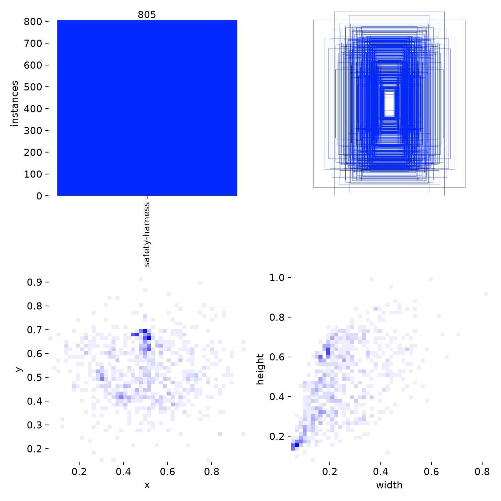

*Рисунок 1 — Визуализация распределения размеченных объектов, сформированная Ultralytics*

## 5. Выбор модели и аугментаций

В качестве базовой модели выбрана YOLO11s с предварительно обученными весами yolo11s.pt. Версия s является компромиссом между скоростью, размером и качеством и рекомендована в задании практики. Модель обучалась для одного класса.

### 5.1. Использованные аугментации

| **Преобразование**       | **Параметр**      | **Обоснование**                                         |
|--------------------------|-------------------|---------------------------------------------------------|
| Изменение оттенка        | hsv_h = 0,015     | Устойчивость к разной цветовой температуре камер.       |
| Насыщенность             | hsv_s = 0,7       | Различия в яркости сигнальной одежды и ремней.          |
| Яркость                  | hsv_v = 0,4       | Съёмка в тени, при контровом и искусственном освещении. |
| Поворот                  | degrees = 5       | Небольшой наклон камеры и человека.                     |
| Сдвиг                    | translate = 0,1   | Изменение положения объекта в кадре.                    |
| Масштаб                  | scale = 0,5       | Работники на разных расстояниях от камеры.              |
| Горизонтальное отражение | fliplr = 0,5      | Левосторонние и правосторонние ракурсы.                 |
| Mosaic                   | mosaic = 1,0      | Повышение разнообразия масштаба и окружения.            |
| Закрытие Mosaic          | close_mosaic = 10 | Последние 10 эпох проходят без Mosaic для стабилизации. |

*Таблица 4 — Настройки аугментаций*

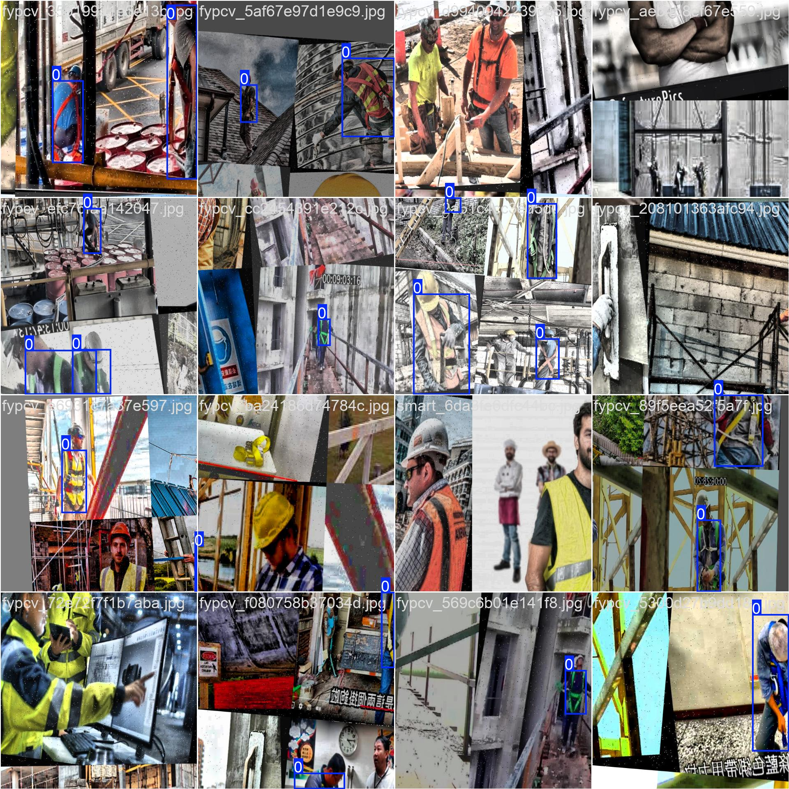

*Рисунок 2 — Пример обучающего batch с применением преобразований*

## 6. Обучение YOLO11s

| **Параметр**            | **Значение**            |
|-------------------------|-------------------------|
| Модель                  | YOLO11s, pretrained     |
| Число эпох              | 100                     |
| Размер изображения      | 640×640                 |
| Batch size              | 16                      |
| Оптимизатор             | auto                    |
| Начальная learning rate | 0,01                    |
| Weight decay            | 0,0005                  |
| Patience                | 25                      |
| Seed                    | 42                      |
| AMP                     | включён                 |
| Кэширование данных      | включено                |
| Время обучения          | 537.9 с (около 9.0 мин) |
| Размер best.pt          | 18.3 МБ                 |

*Таблица 5 — Основные параметры обучения*

Обучение выполнялось на устройстве CUDA с индексом 0. Точная модель графического ускорителя в журнале запуска не зафиксирована. Для воспроизводимости использовались seed 42 и deterministic=True.

```python
from ultralytics import YOLO

model = YOLO("yolo11s.pt")
model.train(
    data="data.yaml",
    epochs=100,
    imgsz=640,
    batch=16,
    cache=True,
    seed=42,
    project="runs_harness",
    name="yolo11s_v1",
)
```

*Листинг 1 — Базовая схема запуска обучения*

Аугментации задавались явными аргументами метода model.train() (см. таблицу 4) и зафиксированы в файле args.yaml запуска; в листинге приведена упрощённая схема вызова.

## 7. Результаты обучения

| **Метрика**  | **Точное значение** | **Округлённо** |
|--------------|---------------------|----------------|
| Precision    | 0.9150              | 0,915          |
| Recall       | 0.8875              | 0,888          |
| F1           | 0.9010              | 0,901          |
| mAP@0.5      | 0.9235              | 0,923          |
| mAP@0.5:0.95 | 0.6202              | 0,620          |

*Таблица 6 — Метрики на 100-й эпохе*

Максимальное значение mAP@0.5, равное 0.9348, было получено на эпохе 77. При этом строгая метрика mAP@0.5:0.95 продолжила расти и достигла максимума 0.6202 на последней эпохе. Одновременное снижение train и validation losses не показывает явного переобучения в пределах проведённого запуска.

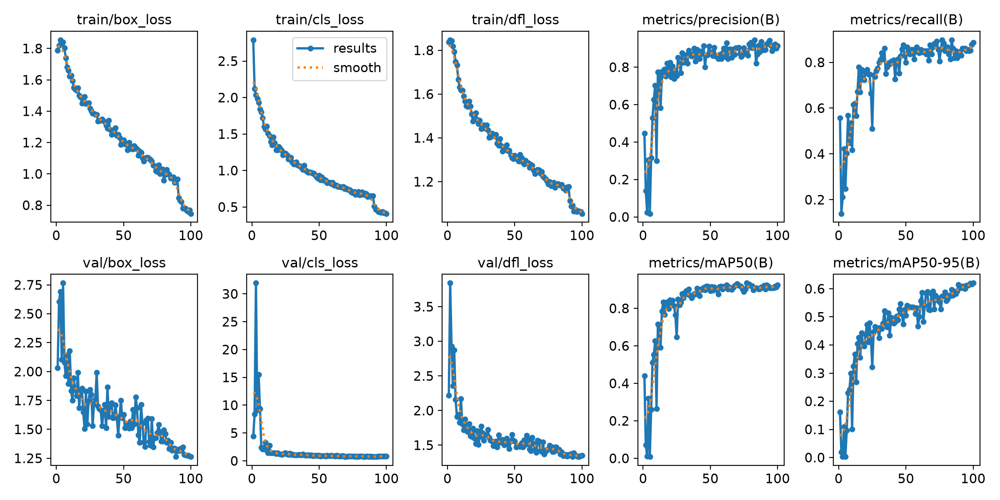

*Рисунок 3 — Динамика losses и метрик на протяжении 100 эпох*

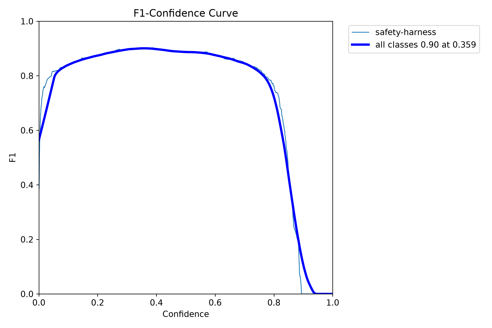

*Рисунок 4 — Зависимость F1 от порога confidence*

По кривой F1 максимальный F1 около 0,90 достигается при confidence примерно 0,359. Это означает, что для демонстрационного применения целесообразно начать с порога 0,35–0,40. Более низкий порог повышает полноту, но увеличивает число ложных срабатываний.

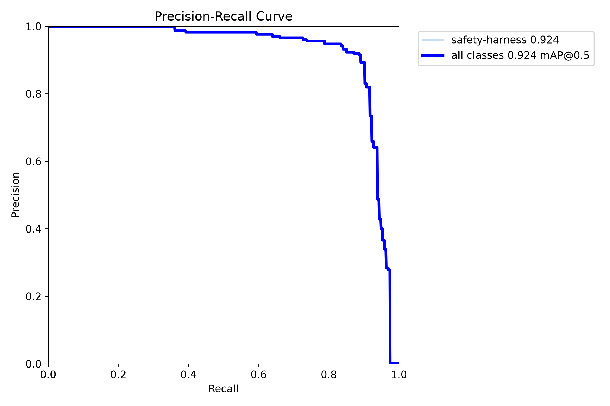

*Рисунок 5 — Precision–Recall кривая модели*

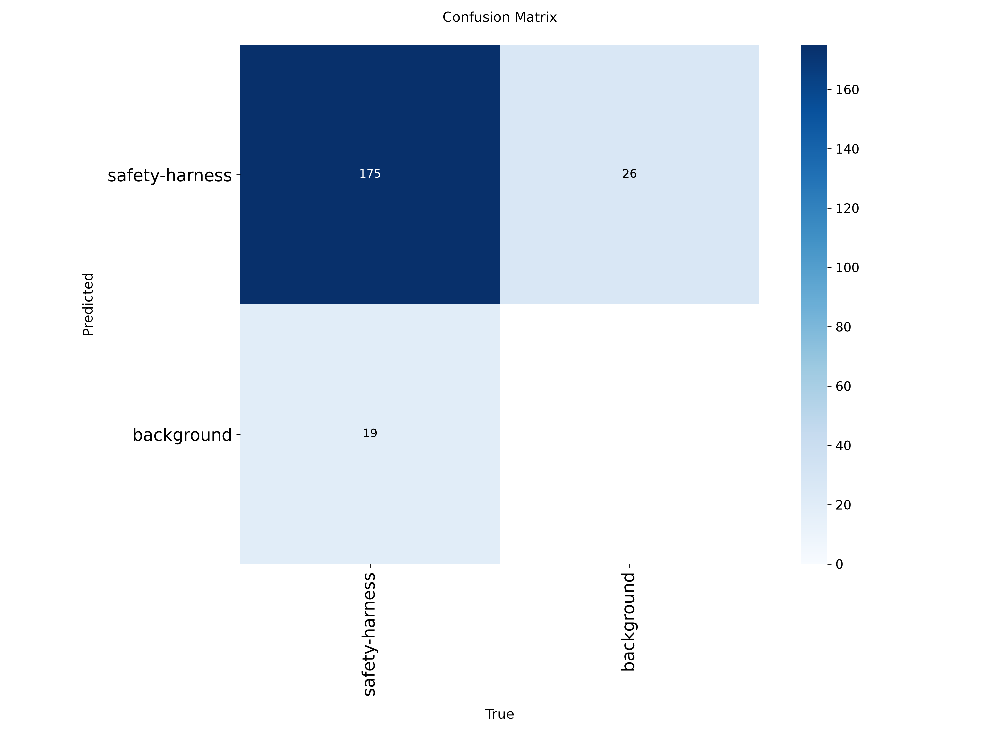

*Рисунок 6 — Матрица ошибок Ultralytics*

Матрица Ultralytics содержит 175 корректных обнаружений, 19 пропусков и 26 ложных срабатываний. Эти значения отличаются от последующего пользовательского анализа, поскольку графики Ultralytics и скрипт используют разные процедуры выбора confidence и сопоставления рамок.

## 8. Анализ валидационной выборки

Дополнительный анализ выполнялся при confidence = 0,25. Предсказание считалось правильным при IoU не менее 0,5. Для каждого кадра вычислялись TP, FP, FN и среднее IoU совпавших рамок. Зелёным цветом на визуализациях обозначена эталонная разметка, красным — предсказание модели.

| **Показатель**              | **Значение**       |
|-----------------------------|--------------------|
| Изображений                 | 200                |
| Положительных изображений   | 160                |
| Отрицательных изображений   | 40                 |
| GT-объектов                 | 194                |
| Предсказанных объектов      | 205                |
| True Positive               | 173                |
| False Positive              | 32                 |
| False Negative              | 21                 |
| Precision при conf=0,25     | 0.844              |
| Recall при conf=0,25        | 0.892              |
| F1 при conf=0,25            | 0.867              |
| Средний IoU совпавших рамок | 0.826              |
| Кадров без ошибок           | 166 из 200 (83.0%) |

*Таблица 7 — Результаты пользовательского анализа validation*

| **Источник**         | **Кадры** | **GT** | **TP** | **FP** | **FN** | **P** | **R** | **Без ошибок** |
|----------------------|-----------|--------|--------|--------|--------|-------|-------|----------------|
| Основной FypCv       | 185       | 175    | 160    | 25     | 15     | 0.865 | 0.914 | 84.3%          |
| Дополнительный Smart | 15        | 19     | 13     | 7      | 6      | 0.650 | 0.684 | 66.7%          |

*Таблица 8 — Качество на изображениях из разных источников*

На основном источнике FypCv получены precision 0,865 и recall 0,914. На дополнительных изображениях Smart Construction значения снизились до 0,650 и 0,684 соответственно. Это является признаком доменного сдвига: модель лучше работает на данных, визуально близких к основной обучающей части, и хуже переносится на новые сцены, стили съёмки и типы страховочных систем.

### 8.1. Распределение ошибок

| **FP + FN на кадре** | **Количество кадров** |
|----------------------|-----------------------|
| 0                    | 166                   |
| 1                    | 24                    |
| 2                    | 5                     |
| 3                    | 3                     |
| 4                    | 1                     |
| 6                    | 1                     |

*Таблица 9 — Число ошибок на одном изображении*

Без ошибок обработано 166 кадров. Ложные срабатывания присутствуют на 25 кадрах, пропуски — на 15 кадрах; одновременно FP и FN наблюдаются на 6 изображениях.

## 9. Характерные успешные примеры

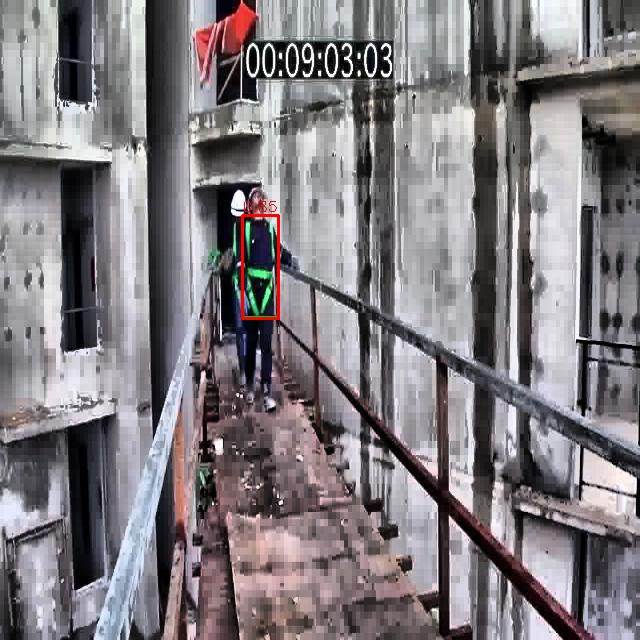

*Пример 1. Ошибок нет, IoU = 0.98.*

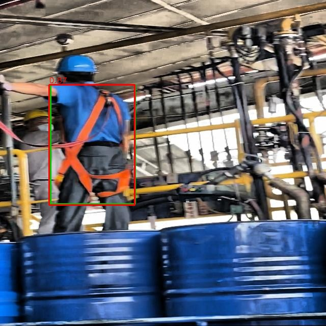

*Пример 2. Ошибок нет, IoU = 0.97.*

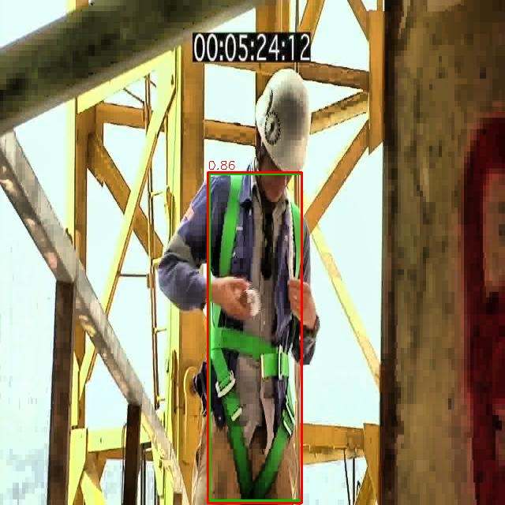

*Пример 3. Ошибок нет, IoU = 0.96.*

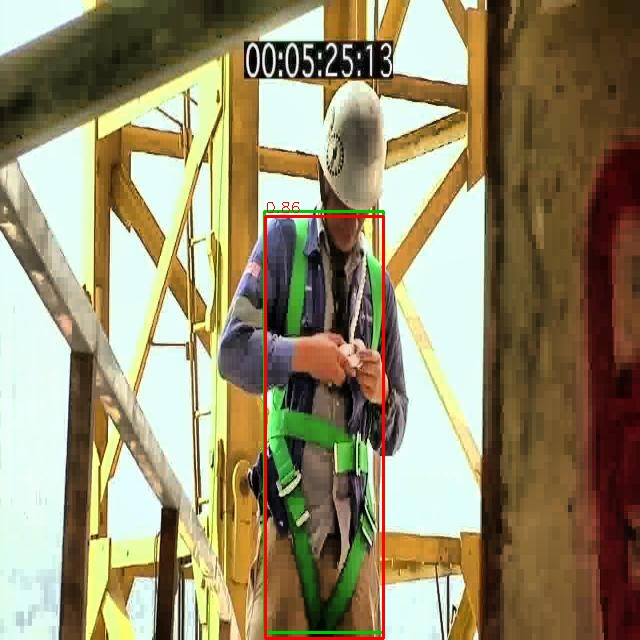

*Пример 4. Ошибок нет, IoU = 0.96.*

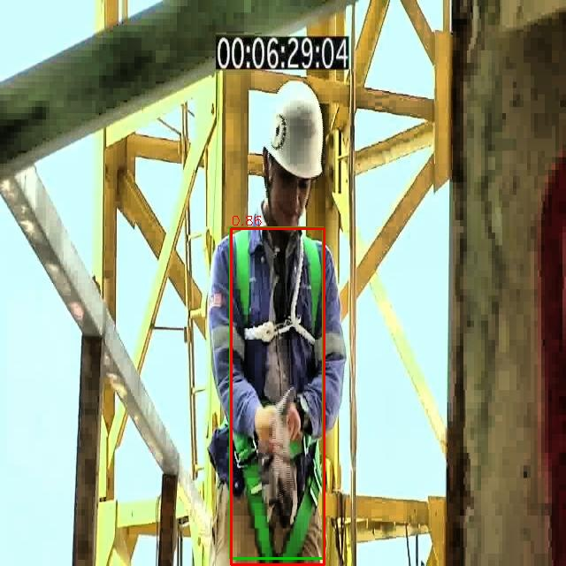

*Пример 5. Ошибок нет, IoU = 0.96.*

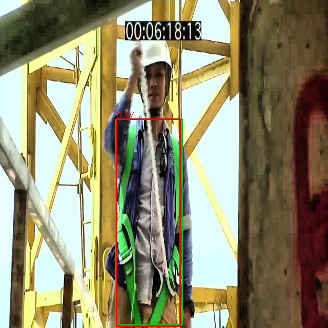

*Пример 6. Ошибок нет, IoU = 0.96.*


*Пример 7. Ошибок нет, IoU = 0.96.*

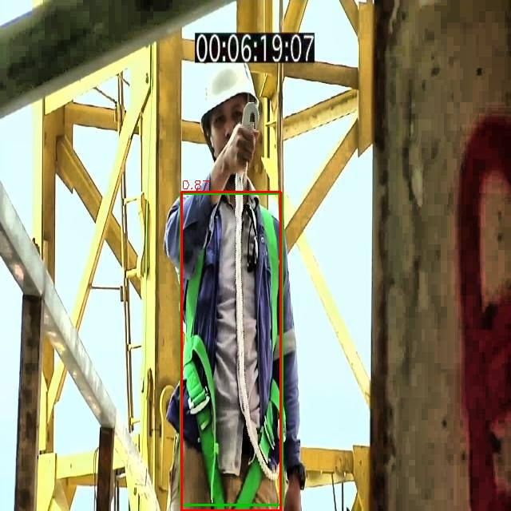

*Пример 8. Ошибок нет, IoU = 0.95.*

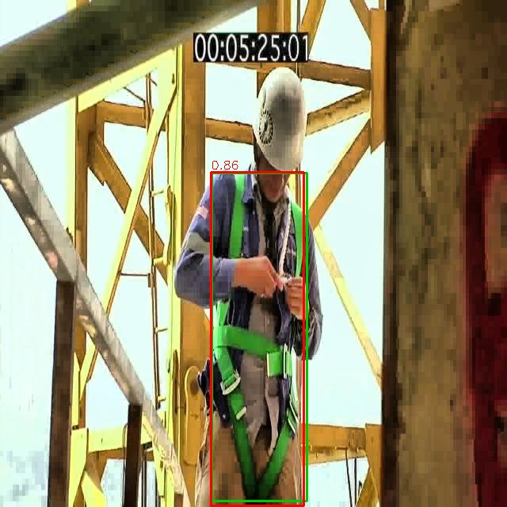

*Пример 9. Ошибок нет, IoU = 0.95.*

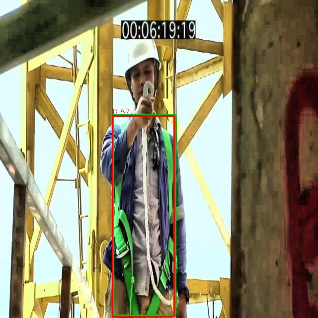

*Пример 10. Ошибок нет, IoU = 0.95.*

Успешные примеры демонстрируют точное совпадение рамок при хорошо различимых контрастных ремнях и среднем масштабе человека. В наборе лучших примеров присутствуют соседние кадры одних видеозаписей. Это повышает визуальную повторяемость результатов и одновременно указывает на недостаточное разнообразие части validation.

## 10. Характерные ошибки модели

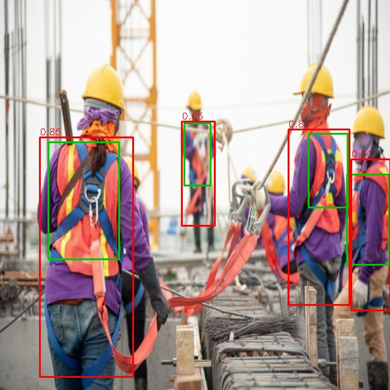

*Пример 1. FP=3, FN=3. Скопление работников: одновременно присутствуют лишние рамки и пропуски отдельных поясов.*

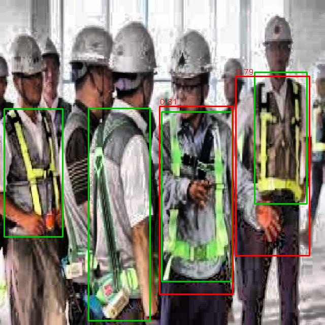

*Пример 2. FP=1, FN=3. Плотная группа людей и перекрытия: модель пропускает несколько объектов и создаёт лишнее обнаружение.*

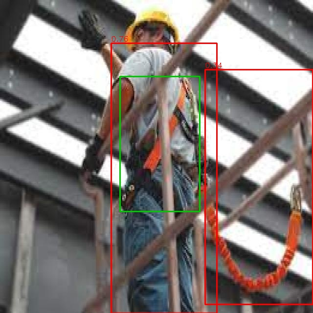

*Пример 3. FP=2, FN=1. Низкое качество и сложная геометрия стропов: дублирование рамок и пропуск эталонного объекта.*

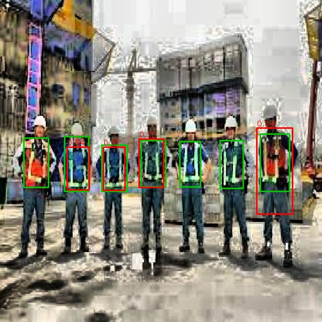

*Пример 4. FP=0, FN=3. Мелкие удалённые объекты в группе: три страховочных пояса не обнаружены.*

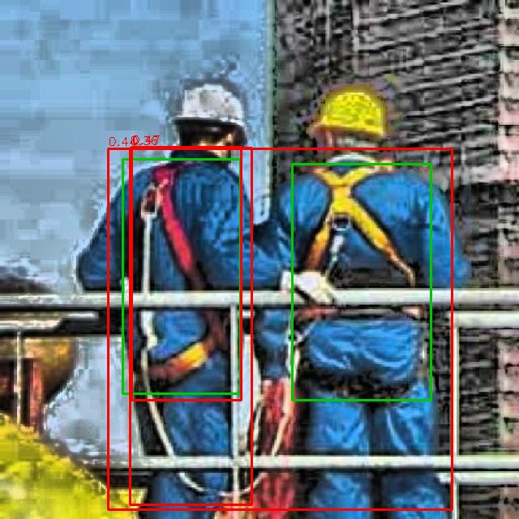

*Пример 5. FP=2, FN=1. Два частично перекрытых работника: несколько лишних рамок и один пропуск.*

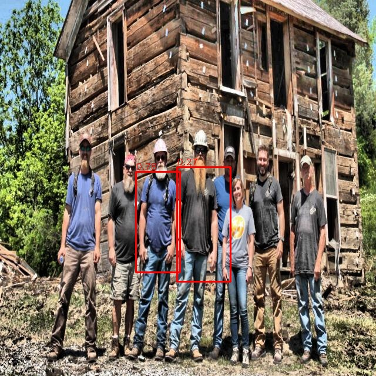

*Пример 6. FP=2, FN=0. Нерелевантная групповая сцена: ремни и одежда ошибочно интерпретируются как страховочный пояс.*

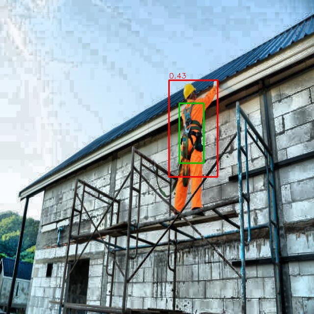

*Пример 7. FP=1, FN=1. Удалённый работник на конструкции: малый масштаб приводит к одновременно FP и FN.*

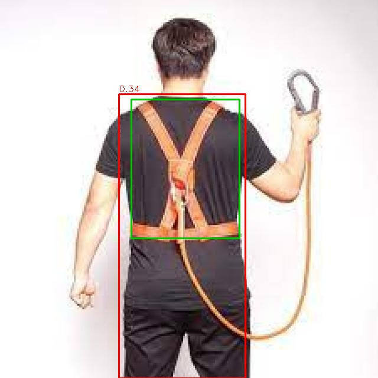

*Пример 8. FP=1, FN=1. Постановочное изображение на белом фоне: рамка предсказания плохо совпадает с принятой схемой GT.*

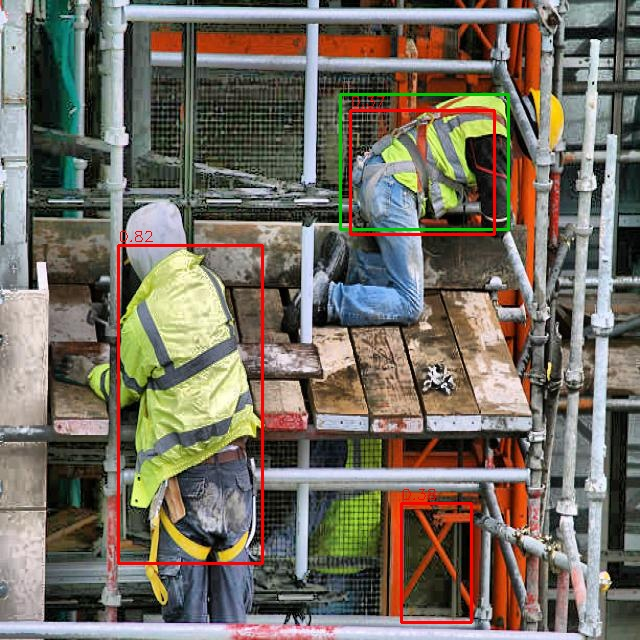

*Пример 9. FP=2, FN=0. Строительные леса и сигнальная одежда: элементы одежды и конструкции вызывают ложные срабатывания.*

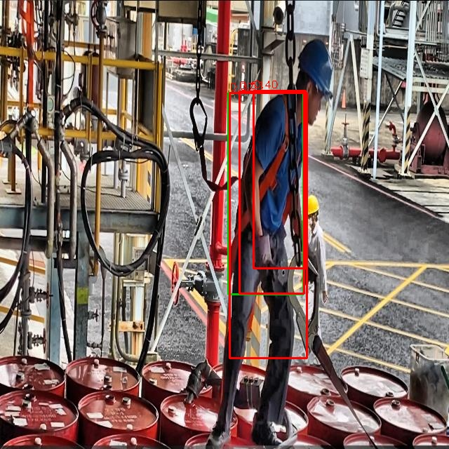

*Пример 10. FP=2, FN=0. Промышленный фон с кабелями и стропами: модель формирует лишние рамки.*

### 10.1. Основные типы ошибок

- пропуски мелких и удалённых страховочных поясов;
- ошибки в группах людей из-за перекрытия объектов;
- ложные срабатывания на сигнальных жилетах, ремнях одежды, кабелях, стропах и элементах конструкций;
- дублирование рамок на одном человеке;
- снижение качества на новом источнике изображений;
- неоднозначность самой схемы разметки: иногда GT охватывает торс человека, а иногда только видимые ремни.

## 11. Ограничения и направления улучшения

**Неоднородность исходных данных.** Часть изображений была предварительно растянута до 640×640 и представлена в нескольких аугментированных вариантах. Полностью восстановить оригиналы невозможно.

**Ограниченный доменный охват.** Основная часть данных происходит из одного публичного набора. Результаты на 15 дополнительных изображениях существенно хуже.

**Повторяемость видеокадров.** В успешных примерах заметны соседние кадры одних видеозаписей, поэтому метрики могут быть оптимистичнее результата на полностью новых объектах.

**Один целевой класс.** Модель находит пояс, но не проверяет связь с конкретным человеком, наличие стропа и факт закрепления.

**Неоднозначная разметка.** Тонкие ремни трудно описывать прямоугольником; большие рамки содержат много фоновых пикселей.

### 11.1. Рекомендуемые улучшения

- собрать дополнительную независимую validation с реальных строительных камер;
- увеличить число кадров с мелкими объектами, плохим освещением и перекрытиями;
- провести повторный аудит и унификацию размеров bounding boxes;
- сравнить YOLO11s и YOLO11m при разрешениях 640 и 960 пикселей;
- подобрать confidence на отдельной тестовой выборке; начальная рекомендуемая область — 0,35–0,40;
- добавить класс person и алгоритм пространственного связывания person ↔ harness;
- в перспективе добавить lifeline и hook либо перейти к сегментации ремней и стропов;
- проверить модель на видеопотоке и оценить частоту ложных тревог в минуту.

## 12. Заключение

В ходе практики был создан прототип детектора страховочных поясов. Проведён обзор литературы, исследованы публичные наборы, выполнен их аудит, унифицирована схема классов и сформирована выборка из 1 000 изображений. На ней обучена модель YOLO11s.

Полученные метрики показывают, что задача в выбранной постановке решается с приемлемым для прототипа качеством: mAP@0.5 = 0.923, mAP@0.5:0.95 = 0.620. При фиксированном confidence 0,25 получены precision 0.844, recall 0.892 и средний IoU совпавших рамок 0.826.

При этом модель пока не готова к использованию как самостоятельный инструмент контроля безопасности. На новых типах изображений качество заметно снижается, а одноклассовая детекция не отвечает на вопрос, правильно ли надет и закреплён пояс. Результат следует рассматривать как baseline, который подтверждает работоспособность подхода и задаёт направления дальнейшего развития.

## 13. Индивидуальный вклад

Настоящий отчёт отражает индивидуальный вклад Коростелева Максима:

- поиск и анализ публикаций по детекции страховочных систем и моделям YOLO;
- поиск, сравнение и аудит открытых датасетов;
- формирование единой схемы класса safety-harness;
- удаление дубликатов и подготовка разбиения train/validation;
- подготовка и проверка разметки в формате Ultralytics YOLO;
- настройка и обучение модели YOLO11s;
- разработка и применение скрипта анализа validation;
- расчёт метрик, отбор успешных и неудачных примеров;
- интерпретация ошибок и подготовка отчёта.

## Список использованных источников

1. Fang W., Ding L., Luo H., Love P. E. D. Falls from Heights: A Computer Vision-Based Approach for Safety Harness Detection // Automation in Construction. 2018. DOI: 10.1016/j.autcon.2018.02.018.
2. Fang C., Xiang H., Leng C., Chen J., Yu Q. Research on Real-Time Detection of Safety Harness Wearing of Workshop Personnel Based on YOLOv5 and OpenPose // Sustainability. 2022. Vol. 14. Article 5872. DOI: 10.3390/su14105872.
3. Wu X. et al. A Remote-Vision-Based Safety Helmet and Harness Monitoring System Based on Attribute Knowledge Modeling // Remote Sensing. 2023. Vol. 15. Article 347. DOI: 10.3390/rs15020347.
4. Chen M. et al. HDS-YOLOv5: An Improved Safety Harness Hook Detection Algorithm Based on YOLOv5s // Mathematical Biosciences and Engineering. 2023. DOI: 10.3934/mbe.2023691.
5. Jiang T. et al. An Improved Safety Belt Detection Algorithm for High-Altitude Work Based on YOLOv8 // Electronics. 2024. Vol. 13. Article 850. DOI: 10.3390/electronics13050850.
6. Zhou Q., Liu D., An K. ESE-YOLOv8: A Novel Object Detection Algorithm for Safety Belt Detection during Working at Heights // Entropy. 2024. Vol. 26. Article 591. DOI: 10.3390/e26070591.
7. Zhou Q., Liu D. Improving Safety in High-Altitude Work: Semantic Segmentation of Safety Harnesses with CEMFormer // Symmetry. 2024. Vol. 16. Article 1449. DOI: 10.3390/sym16111449.
8. Филичкин С. А., Вологдин С. В. Сравнение эффективности алгоритмов YOLOv5 и YOLOv8 для обнаружения средств индивидуальной защиты человека // Интеллектуальные системы в производстве. 2023. Т. 21. № 3. С. 124–131. DOI: 10.22213/2410-9304-2023-3-124-131.
9. Тимошкин М. С., Миронов А. Н., Леонтьев А. С. Сравнение YOLOv5 и Faster R-CNN для обнаружения людей на изображении в потоковом режиме // Международный научно-исследовательский журнал. 2022. № 6-1 (120). С. 137–146. DOI: 10.23670/IRJ.2022.120.6.020.
10. Васильев М. Е., Шалимов А. С., Савина О. А. Обзор версий YOLO: одноэтапная модель свёрточной нейронной сети // Universum: технические науки. 2025. № 6 (135).
11. Ultralytics. YOLO Documentation. URL: https://docs.ultralytics.com/ (дата обращения: 30.06.2026).
12. Roboflow Universe. Safety Harness by FypCv. URL: https://universe.roboflow.com/fypcv/safety-harness-iess4 (дата обращения: 30.06.2026).
13. Roboflow Universe. Safety harness for smart construction. URL: https://universe.roboflow.com/study-dopms/safety-harness-for-smart-construction (дата обращения: 30.06.2026).

## Приложение А. Состав предоставленных артефактов

| **Файл/папка**                         | **Назначение**                             |
|----------------------------------------|--------------------------------------------|
| result/yolo11s_v1/weights/best.pt      | Лучшие веса обученной модели.              |
| result/yolo11s_v1/results.csv          | Метрики и losses по каждой эпохе.          |
| result/yolo11s_v1/results.png          | Сводные графики обучения.                  |
| result/yolo11s_v1/confusion_matrix.png | Матрица ошибок Ultralytics.                |
| result/analysis/per_image_stats.csv    | Покадровые TP, FP, FN и IoU.               |
| result/analysis/examples_good          | 10 кадров с корректными предсказаниями.    |
| result/analysis/examples_bad           | 10 кадров с наибольшим числом ошибок.      |
| analyze_val.py                         | Скрипт дополнительного анализа validation. |
